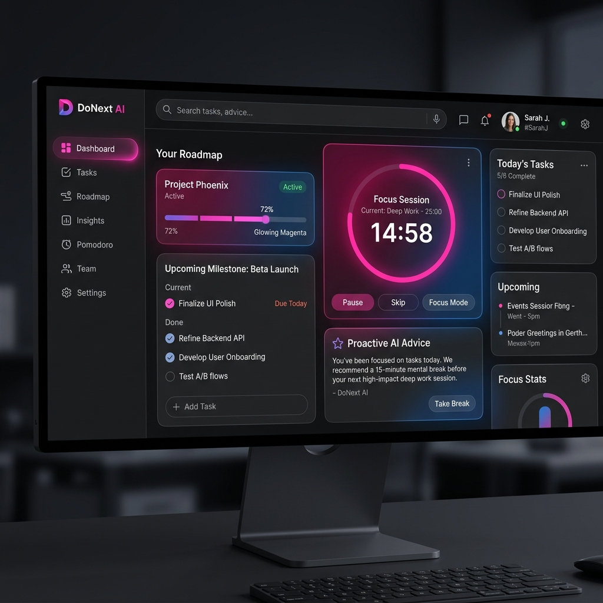
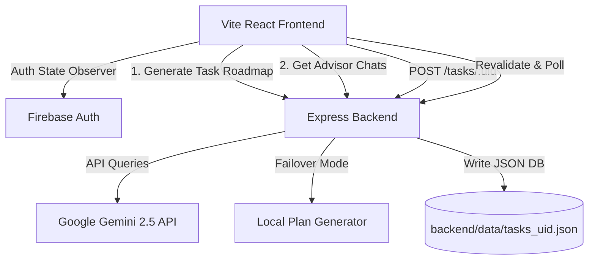

# DoNext AI 🚀

<div align="center">


**Know exactly what to do next. Beat the deadline panic.**

[](https://react.dev/)
[](https://vitejs.dev/)
[](https://expressjs.com/)
[](https://firebase.google.com/)
[](https://deepmind.google/technologies/gemini/)

*DoNext AI is an agentic last-minute productivity companion designed to save your hackathons, midsems, and project submissions. Built on Google Gemini 2.5 and Material 3 design systems.*

[Key Features](#-key-features) • [Interactive Mockup](#-dashboard-interface) • [Architecture](#-architecture) • [Getting Started](#-getting-started) • [Gamification](#-gamified-achievements)

</div>

---

## 🔮 Overview

**DoNext AI** is not just another todo list. It is an agentic scheduler designed to fight the anxiety of approaching deadlines. By taking task inputs via text or hands-free voice dictation, the app queries the **Google Gemini API** to output a prioritized, actionable 6-step roadmap checklist. It keeps you focused on the **one single next action** you must take, supports real-time multi-browser synchronization, and includes a Pomodoro Focus Session dial.

---

## ⚡ Key Features

*   🎙️ **Speech-to-Text Dictation**: Dictate tasks hands-free using the Web Speech API directly in the prompt bar.
*   🤖 **Proactive AI Advisor**: A sidebar chat companion powered by Google Gemini that analyzes your active task list, smart-sorts deadlines, and gives real-time advice.
*   🔄 **Real-Time Cross-Browser Sync**: Log in with the same account across tabs, browsers, or devices. Focus revalidation and active background polling keep tasks in sync.
*   🏆 **Milestone Gamification**: Unlock credentials and badges (e.g., *Voice Pioneer*, *Focus Master*, *Calendar Synchronizer*, *Conqueror*) saved directly to your profile.
*   ⏱️ **Pomodoro Focus Sessions**: Integrated 25-minute focus dial with break transitions and progressive progress rings to keep you productive.
*   📅 **Calendar Export**: Instantly package and download your AI roadmap checklist into a standard `.ics` file for easy calendar imports.

---

## 🖥️ Dashboard Interface

<div align="center">



*The Gemini-themed Material 3 dark mode dashboard features glowing auroras, flat card layouts, progress meters, and dynamic AI advisories.*

</div>

---

## ⚙️ Architecture

DoNext AI leverages a decoupled React client and Express backend architecture with Firebase Authentication. Data is persisted securely in local browser storage and back-saved to a lightweight JSON database store.



---

## 🚀 Getting Started

### Prerequisites
- Node.js (v18+)
- Firebase Web App credentials (configured in frontend)
- Google Gemini API key

### 1. Backend Setup
1. Navigate to the `backend/` directory:
   ```bash
   cd backend
   ```
2. Create a `.env` file in the backend root:
   ```env
   PORT=5000
   GEMINI_API_KEY=your_gemini_api_key_here
   ```
3. Install dependencies and start the server:
   ```bash
   npm install
   npm start
   ```

### 2. Frontend Setup
1. Navigate to the `frontend/` directory:
   ```bash
   cd frontend
   ```
2. Install dependencies:
   ```bash
   npm install
   ```
3. Run the Vite development server:
   ```bash
   npm run dev
   ```
4. Access the dashboard at `http://localhost:5173`.

---

## 🏆 Gamified Achievements

Earn unique badges for completing high-productivity tasks:

| Badge | Achievement Icon | Unlock Condition |
| :--- | :---: | :--- |
| **Voice Pioneer** | 🎙️ | Dictate a task roadmap title using Speech-to-Text. |
| **Focus Master** | ⏱️ | Start and run the Pomodoro Focus Session Timer. |
| **Cal Synchronizer** | 📅 | Export an AI-planned roadmap checklist as an `.ics` file. |
| **Conqueror** | 🏆 | Complete the final checklist item of an active task roadmap. |

---

<div align="center">

*Designed and crafted with 💜 matching the Google Gemini Brand Guidelines.*

</div>
